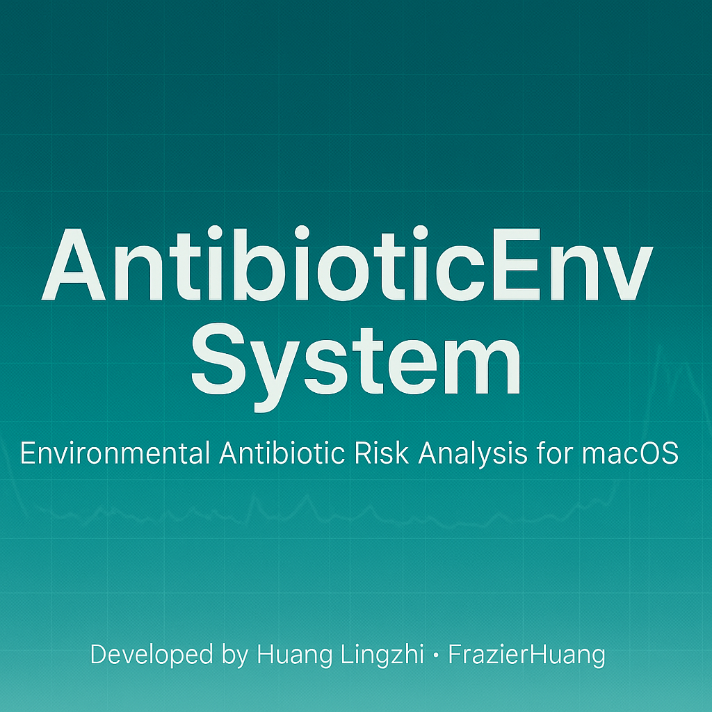

<<<<<<< HEAD
# 🧬 AntibioticEnv System（环境抗生素污染分析系统）

=======
<p align="center">
  
</p>

# 🧬 AntibioticEnv System（环境抗生素污染分析系统）

>>>>>>> 33ffb6e (Initial commit: AntibioticEnv System v1.0)
**版本 Version:** 1.0  
**平台 Platform:** macOS  
**作者 Author:** 黄凌志 (Huang Lingzhi)  
**日期 Date:** November 2025  
**GitHub:** [FrazierHuang](https://github.com/FrazierHuang)

---


---

## 🌍 项目简介 | Project Overview

**AntibioticEnv System** 是一款基于 macOS 的科研分析软件，  
用于抗生素在环境中的分布特征与生态风险分析。  
软件集成了数据导入、风险计算（RQ、PI、RRQ）与可视化输出，  
帮助研究者快速开展抗生素污染风险评估。

This macOS-based scientific software integrates data preprocessing, risk indicator computation, and visualization for antibiotic pollution analysis in aquatic environments.

---

## 🚀 核心功能 | Core Functions

| 功能模块 | 功能描述 | Description |
|-----------|-----------|--------------|
| 📥 数据导入 | 支持 CSV / Excel 文件导入 | Import CSV/Excel data |
| 🧮 风险评估 | 自动计算 RQ、PI、RRQ | Automatic risk computation |
| 📊 可视化 | 输出时空分布图、风险矩阵图、超标率图 | Visualization: spatiotemporal, risk matrix, exceedance |
| 🧾 报告导出 | 导出 Excel / Markdown 报告 | Export results in Excel or Markdown |
| 💻 图形界面 | 采用 PyQt6 + Matplotlib 构建 | Built with PyQt6 and Matplotlib |

---

## 💻 系统要求 | System Requirements

| 项目 | 说明 |
|------|------|
| 操作系统 | macOS 12 或更高版本（支持 M1/M2/M3） |
| 运行环境 | 无需 Python（DMG 版已内置） |
| 推荐分辨率 | 1440×900 及以上 |

---

## 📦 安装方式 | Installation

### ✅ 方法一：使用 DMG 安装包（推荐）
1. 从 GitHub Releases 页面下载最新版：  
   [⬇️ 下载 AntibioticEnvSystem.dmg](https://github.com/FrazierHuang/AntibioticEnvSystem/releases/download/v1.0/AntibioticEnvSystem.dmg)
2. 双击 `.dmg` 文件并拖拽应用到 **Applications** 文件夹；
3. 若首次运行被阻止，请右键点击 → 选择 “打开”。
<<<<<<< HEAD
=======

### 🧰 方法二：源码运行（开发者模式）
```bash
git clone https://github.com/FrazierHuang/AntibioticEnvSystem.git
cd AntibioticEnvSystem
pip install -r requirements.txt
python3 main_gui.py
>>>>>>> 33ffb6e (Initial commit: AntibioticEnv System v1.0)

### 🧰 方法二：源码运行（开发者模式）
```bash
git clone https://github.com/FrazierHuang/AntibioticEnvSystem.git
cd AntibioticEnvSystem
pip install -r requirements.txt
python3 main_gui.py

<<<<<<< HEAD
📊 示例数据 | Example Data
examples/template_antibiotic_data.xlsx

📈 输出结果 | Output Files
文件名                      内容说明
plot_spatiotemporal.png   抗生素时空分布图
plot_risk_matrix.png      风险矩阵图
plot_exceedance.png       超标率图
outputs_report.md         Markdown 报告
outputs.xlsx             风险与统计结果表

🧩 项目结构 | Project Structure
=======
## 📊 示例数据 | Example Data
examples/template_antibiotic_data.xlsx
包括洞庭湖典型样点、不同水体类型（自然/养殖）与季节（丰水期/枯水期）的抗生素浓度数据。
The example dataset covers typical sampling sites and seasonal variations of antibiotics.

---

## 🧩 项目结构 | Project Structure
>>>>>>> 33ffb6e (Initial commit: AntibioticEnv System v1.0)
AntibioticEnvSystem/
├── main_gui.py                  # 主界面
├── run_all.py                   # 核心分析流程
├── antibiotic_env/              # 功能模块
│   ├── calc_rq.py               # 风险计算
│   ├── plot_viz.py              # 可视化
│   └── utils.py                 # 工具函数
├── examples/                    # 示例数据
│   └── template_antibiotic_data.xlsx
├── outputs/                     # 输出结果
├── AntibioticEnvSystem.icns     # 图标文件
├── AntibioticEnvSystem.dmg      # 安装包
└── README.md                    # 项目说明文件

<<<<<<< HEAD
📚 引用格式 | Citation
=======

---

## 📚 引用格式 | Citation
>>>>>>> 33ffb6e (Initial commit: AntibioticEnv System v1.0)
如果在研究中使用了本软件，请引用以下格式：
If you use this software in your research, please cite:

Huang, L. (2025). AntibioticEnv System v1.0: A macOS-based environmental antibiotic risk analysis software.
<<<<<<< HEAD
GitHub Repository: https://github.com/FrazierHuang/AntibioticEnvSystem

🧠 后续开发 | Future Work
=======
GitHub Repository: https://github.com/FrazierHuang/AntibioticEnvSystem

---

## 🧠 后续开发 | Future Work
>>>>>>> 33ffb6e (Initial commit: AntibioticEnv System v1.0)
	•	支持 Windows 平台
	•	增加“水–沉积物–生物”多介质模型
	•	自动生成 PDF 风险评估报告
	•	引入蒙特卡罗模拟的人体健康风险模块

<<<<<<< HEAD
💬 联系方式 | Contact

Author: 黄凌志
Email: 1154047309@qq.com
GitHub: github.com/FrazierHuang
=======
## 💬 联系方式 | Contact
Author: 黄凌志
Email: 1154047309@qq.com
GitHub: github.com/FrazierHuang
>>>>>>> 33ffb6e (Initial commit: AntibioticEnv System v1.0)

⸻

© 2025 Huang Lingzhi.
本软件用于环境科学科研用途，禁止未经授权的商业使用。
<<<<<<< HEAD
This software is intended for academic research only. All rights reserved.

